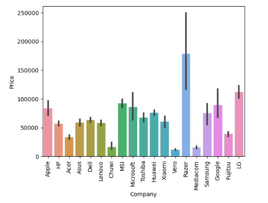
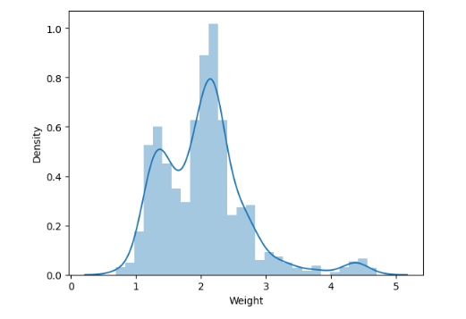
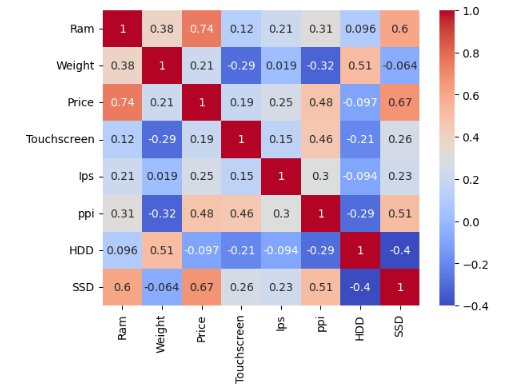

# Laptop Price Prediction

This project aims to develop a machine-learning model that predicts the prices of laptops based on various features and specifications. Consumers, sellers, or manufacturers can use the model to estimate laptop prices in the market.

## Introduction

This project aims to develop a machine-learning model that predicts laptop prices based on various features and specifications.

The model is useful for consumers, sellers, or manufacturers to estimate laptop prices in the market.

## Dataset

The project utilizes a dataset containing labelled laptop data, including prices and specifications.

Features in the dataset include brand, processor type, RAM size, storage capacity, screen size, and more.

The dataset has been preprocessed and cleaned for training and testing the machine learning model.

Dataset [https://github.com/Farhan5217/Laptop-Price-Prediction-Model/blob/main/LaptopPrice.csv]

## Requirements 

Make to sure meet the necessary Requirements.

requirement.txt [https://github.com/Farhan5217/Laptop-Price-Prediction-Model/blob/main/requirements.txt]

## Usage

To use the laptop price prediction model, follow these steps:

1) Prepare your input data in the required format, ensuring it includes the necessary specifications of the laptop.

2) Load the trained model.

3) Make predictions.

4) Adjust the input data as required to experiment with different laptop configurations and predict their prices.
## Results

The performance of the laptop price prediction model achieved an accuracy of 81% on the test dataset using Random Forest. The model was evaluated using various metrics such as mean absolute error (MAE) and negative mean squared error, demonstrating its effectiveness in estimating laptop prices.

## Contributing

Contributions to this project are welcome! If you have any ideas for improvements or find any issues, please open an issue or submit a pull request. Let's collaborate and make this project even better!
